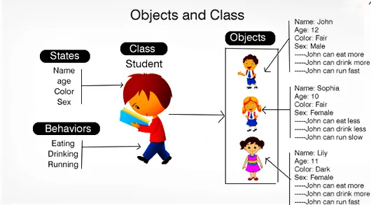

# Fundamentos de POO em Java

## Objetivos
* Abrodar os conceitos do paradigma e seus pilares
* Classes
* Enums
* Construtores
* Java Beans
* UML

## Assuntos
* Conceitos de POO
* Pacotes e Visibilidade de Recursos 
* Classes e Construtores
* Java Beans e UML
* Pilares da POO
* Enums e Interfaces

## Conceitos de POO
POO é um paradigma baseado no conceito de objetos, que podem conter dados na forma de campos, também conhecidos como `atributos`, e códigos, na forma de procedimentos conhecidos como `métodos`.

Enquanto a programação estruturada é voltada a procedimentos e funções definidas pelo usuário, a programação orientada a objetos é voltada a conceitos como o de classes e objetos.

## Classes
Toda a estrutura na linguagem Java é distribuida em arquivos com extensão **.java** denominados de **classe**.
As classes são compostas por:
* Identificador
* Características
* Comportamentos

### Classe (class):
A estrutura e ou representação que direciona a criação dos objetos de mesmo tipo.
### Identificador (identity):
Propósito existencial aos objetos que serão criados.
### Características (states):
Também conhecidas como **atributos** ou **propriedades**, é toda a informação que representa o estado do objeto.
### Comportamentos (behavior):
Também conhecido como **ações** ou **métodos**, é toda parte comportamental que um objeto dispõe.
### Instaciar (new):
É o ato de criar um objeto a partir de uma estrutura definida em uma classe.

<h3 align="center">Exemplo de Classe e Objeto</h3>

  

Seguindo algumas convenções, as nossas classes são classificadas como:
* **Classes de Modelo (model)**: classes que representam estrutura de domínio da aplicação, exemplo: Cliente, Pedido, Nota Fiscal, outros.
* **Classe de Serviço (service)**: classes que conténs regras de negócio e validação de nosso sistema.
* **Classe de repositório (repository)**: classes que contém uma integração com DBs.
* **Classe de controle (controller)**: classes que possuem a finalidade de disponibilizar alguma comunicação externa à nossa aplicação, tipo http web, webservices, API.
* **Classe utilitária (util)**: classe que contém recursos comuns à toda nossa aplicação.

<h3 align="center">Exemplo de Arquitetura MVC</h3>

  

